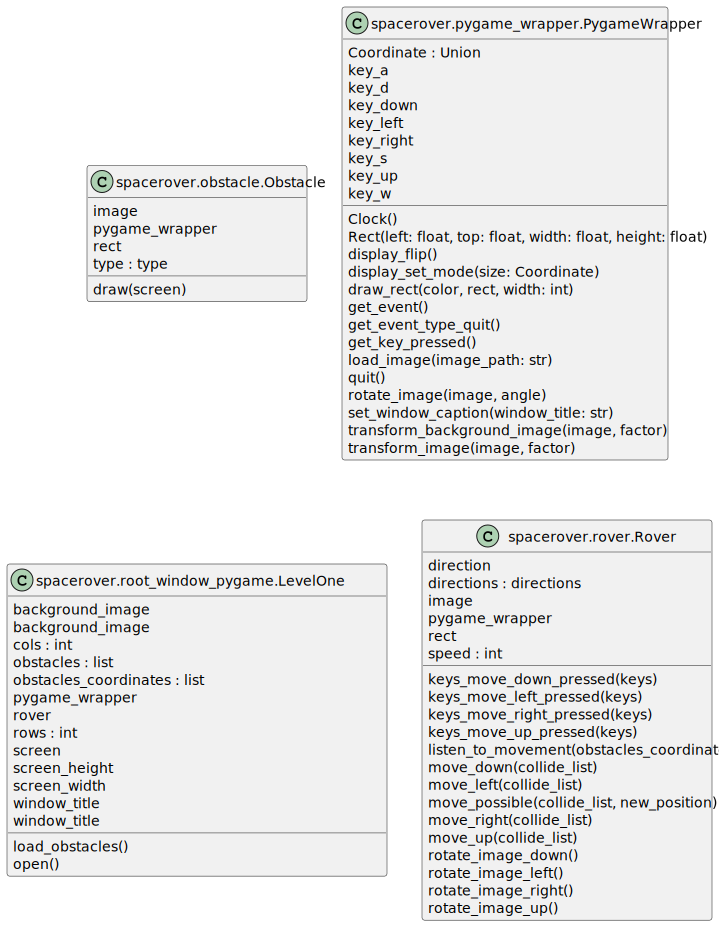
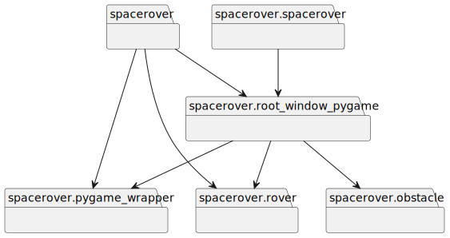

# Architecture

## Workflows

* rover can move forward / backwards / left / right. (if one movement should be deactivated, they have to be splitted worklows)
* When roves is moved, there has to be a check if move is possible or blocked because of an obstacle.

## Forbidden Dependencies

* map -> rover

## Dependencies

All imported Modules which are not created by us, will be wrapped. This makes it easy to replace them with other ones and the dependency are clear.

## Method naming

Method names should be an extended description on what the method actually does. Long method names are allowed.

## Class Diagram

## Packages

