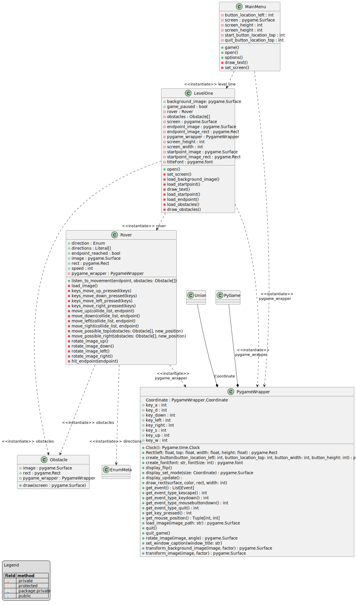

# Architecture

## Workflows

* rover can move forward / backwards / left / right. (if one movement should be deactivated, they have to be splitted worklows)
* rover doesn't hit the obstacles.

## Class Diagram

## Packages

