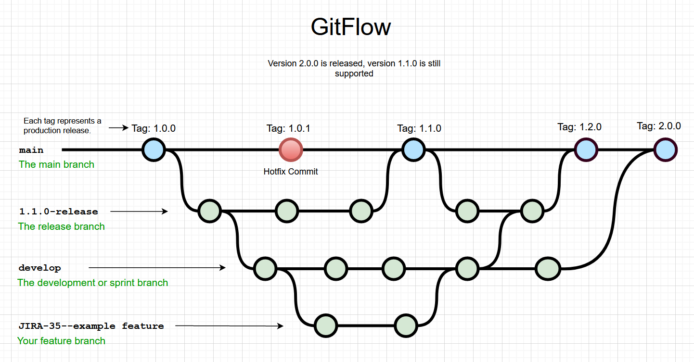

# How to contribute

You have a cool idea or you found a bug in our code? Please feel free to create a [fork] of our repository and create a [Pull Request].  
If you're new to pyhton, here's a guide how to contribute to our repository and get a part of our space rover game.

## Step by step guide to contribute

### 1. Create a Fork

We use the [Gitflow Workflow]. The first thing you need to do is create a [fork] of our repository.



### 2. Clone repository

Next step, you need to [clone] your forked repository to your local machine.

``` ps
git clone <repositoryUrl>
```

### 3. Setup your environment

We recommend working with Visual Studio Code. Have a look into the [vs code installation guide] and follow the steps.

### 4. Install dependencies

Download latest [pyhton] version and click through installation. Maybe you have to restart your machine after this step.

Run the following commands to install the dependencies we used.

#### PyGame

``` ps
pip install pygame
```

#### MkDocs

``` ps
pip install mkdocs
```

For more information how to run mkdocs and how we used it, have a look at [mkdocs.md]

[Gitflow Workflow]: https://www.atlassian.com/git/tutorials/comparing-workflows/gitflow-workflow
[Pull Request]: https://docs.github.com/en/pull-requests/collaborating-with-pull-requests/proposing-changes-to-your-work-with-pull-requests/creating-a-pull-request
[fork]: https://docs.github.com/en/get-started/quickstart/fork-a-repo
[clone]: https://docs.github.com/en/repositories/creating-and-managing-repositories/cloning-a-repository
[vs code installation guide]: https://code.visualstudio.com/docs/python/python-tutorial
